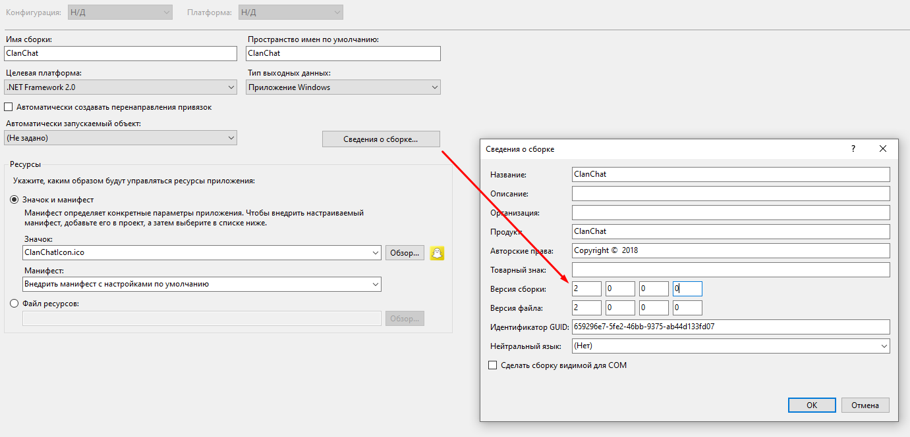

# ClanChatLineage
EN: Tool for chat in lineage 2 on all chronicles.
RU: Утилита для чата в lineage 2 на всех хрониках.

**EN Features:**
 + 1. You can send in chat messages with interval.
 + 2. Select chat where need send message.
 + 3. With hotkeys you can controll your tool.
 
**EN How install:**
 + 1. Open in sources file Form1.cs search line and change adress on your in http://localhost
 + 2. Change version like on current photo.
 
 + 3. Compile project.
 + 4. Web part no need, but need copy files exe and dll, more change version in AutoUpdaterVersion.txt
 
**RU Возможности:**
 + 1. Вы можете отправить в чат сообщение с интервалом.
 + 2. Выбрать чат где нужно отправить сообщение.
 + 3. С горячими клавишами ты можешь контролировать свою утилиту.
 
**RU Как установить:**
 + 1. Открываем в исходниках файл Form1.cs находим строчку и указываем свой адрес в http://localhost
 + 2. Указываем версию как на фото ниже.
 
 + 3. Компилируем проект.
 + 4. Веб часть не нужна, но нужно закинуть будет exe и dll, еще указать версию в AutoUpdaterVersion.txt